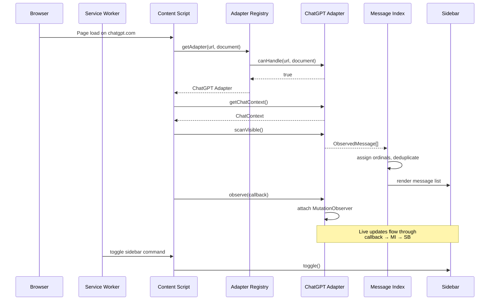

# Design Document: MessageRail Extension

## Overview

MessageRail is a privacy-first Manifest V3 browser extension that injects a "Message Index" sidebar into AI chat web applications. The extension indexes visible conversation messages, assigns stable ordinal numbers, and provides search and jump-to-message navigation — all without any network communication.

The architecture follows a **provider-adapter pattern** where each supported AI chat site (ChatGPT, Claude, Gemini, Grok, Perplexity) has a dedicated adapter module implementing a common `SiteAdapter` interface. An adapter registry selects the correct adapter at runtime based on the current page URL. The sidebar is injected via Shadow DOM to isolate its styles from the host page, and a MutationObserver keeps the message index synchronized with live DOM changes including streaming responses.

All data is stored locally: IndexedDB for message records and pin metadata, `chrome.storage.local` for lightweight preferences. No telemetry, analytics, or external network requests are made.

### Key Design Decisions

| Decision | Rationale |
|---|---|
| Shadow DOM for sidebar | Prevents host-page CSS from breaking sidebar styles and vice versa |
| Provider-adapter pattern with registry | New providers require only a new adapter module — no changes to core logic |
| MutationObserver for live updates | Avoids polling; reacts to DOM changes as they happen |
| IndexedDB over localStorage | Supports structured data, indexes, and larger storage quotas; avoids touching host-page storage |
| Deterministic Message_UID | Enables deduplication without server-side IDs; based on provider + chatId + role + ordinal + text checksum |
| TypeScript with minimal build | Type safety during development with a simple esbuild/rollup pipeline — no heavy framework |
| ChatGPT-first with stubs | Delivers value immediately while the adapter pattern ensures extensibility |

## Architecture

### High-Level Component Diagram

```mermaid
graph TB
    subgraph "Browser Extension (Manifest V3)"
        SW[Service Worker<br/>background.ts]
        CS[Content Script<br/>content.ts]
        PP[Popup Page<br/>popup.html]
    end

    subgraph "Content Script Modules"
        AR[Adapter Registry]
        CGP[ChatGPT Adapter]
        CLA[Claude Adapter stub]
        GEM[Gemini Adapter stub]
        GRK[Grok Adapter stub]
        PPX[Perplexity Adapter stub]
        MI[Message Index]
        SB[Sidebar Controller]
        SD[Shadow DOM Host]
        LA[LiveAnchor Manager]
        IDB[IndexedDB Store]
        PS[Preferences Store]
    end

    SW -->|chrome.runtime messages| CS
    CS --> AR
    AR --> CGP
    AR --> CLA
    AR --> GEM
    AR --> GRK
    AR --> PPX
    CGP -->|ObservedMessage[]| MI
    MI --> SB
    SB --> SD
    SB --> LA
    MI --> IDB
    SB --> PS
    LA -->|scrollIntoView| HostPage[Host Page DOM]
    CGP -->|MutationObserver| HostPage
```

### Extension Lifecycle Flow



## Components and Interfaces

### SiteAdapter Interface

The core abstraction that all provider adapters implement.

```typescript
interface SiteAdapter {
  /** Returns true if this adapter handles the given URL and document. */
  canHandle(url: URL, doc: Document): boolean;

  /** Extracts context about the current conversation. */
  getChatContext(doc: Document): ChatContext | null;

  /** Scans the DOM and returns all currently visible messages. */
  scanVisible(doc: Document): ObservedMessage[];

  /** Attaches a MutationObserver and calls onUpdate when messages change.
   *  Returns a cleanup function that disconnects the observer. */
  observe(doc: Document, onUpdate: (messages: ObservedMessage[]) => void): () => void;

  /**
   * Given an ObservedMessage, returns a LiveAnchor bound to the DOM element.
   * Returns null if the element is no longer in the DOM.
   */
  materializeMessage(msg: ObservedMessage, doc: Document): LiveAnchor | null;

  /** Returns true if the adapter's expected DOM structure is still present. */
  healthcheck(doc: Document): boolean;
}
```

### AdapterRegistry

```typescript
class AdapterRegistry {
  private adapters: SiteAdapter[] = [];

  register(adapter: SiteAdapter): void;

  /** Iterates registered adapters and returns the first whose canHandle returns true. */
  getAdapter(url: URL, doc: Document): SiteAdapter | null;
}
```

### MessageIndex

Manages the ordered collection of messages, ordinal assignment, deduplication, and persistence.

```typescript
class MessageIndex {
  private messages: Map<string, IndexedMessage>;
  private ordinalCounter: number;

  /** Ingests raw ObservedMessages, normalizes text, assigns ordinals, deduplicates. */
  update(incoming: ObservedMessage[]): void;

  /** Returns all indexed messages in ordinal order. */
  getAll(): IndexedMessage[];

  /** Returns messages matching a case-insensitive substring search. */
  search(query: string): IndexedMessage[];

  /** Toggles pin state for a message and persists to IndexedDB. */
  togglePin(uid: string): Promise<void>;

  /** Returns all pinned messages. */
  getPinned(): IndexedMessage[];

  /** Loads persisted pins from IndexedDB for the current chat. */
  loadPins(chatId: string): Promise<void>;
}
```

### SidebarController

Manages the Shadow DOM host element, renders the message list, search UI, and handles user interactions.

```typescript
class SidebarController {
  private shadowRoot: ShadowRoot;
  private collapsed: boolean;

  /** Creates the Shadow DOM host and injects sidebar markup. */
  mount(hostPage: Document): void;

  /** Re-renders the message list from the current MessageIndex state. */
  render(messages: IndexedMessage[]): void;

  /** Toggles collapsed/expanded state. */
  toggle(): void;

  /** Moves keyboard focus to the search input, expanding if collapsed. */
  focusSearch(): void;

  /** Cleans up the sidebar DOM element. */
  unmount(): void;
}
```

### LiveAnchor

Binds a message UID to a DOM element for navigation.

```typescript
interface LiveAnchor {
  uid: string;
  element: Element;

  /** Smooth-scrolls the element into view. */
  scrollIntoView(): void;

  /** Moves keyboard focus to the element or a focusable child for accessibility. */
  focusForA11y(): void;
}
```

### IndexedDBStore

Thin wrapper around IndexedDB for message and pin persistence.

```typescript
class IndexedDBStore {
  private db: IDBDatabase | null;
  private readonly DB_NAME = 'messagerail';
  private readonly DB_VERSION = 1;

  /** Opens the database and creates object stores if needed. */
  open(): Promise<void>;

  /** Persists a pin record. */
  putPin(pin: PinRecord): Promise<void>;

  /** Removes a pin record by UID. */
  deletePin(uid: string): Promise<void>;

  /** Returns all pins for a given chat ID. */
  getPinsByChatId(chatId: string): Promise<PinRecord[]>;

  /** Persists a batch of message records. */
  putMessages(messages: StoredMessage[]): Promise<void>;

  /** Returns all stored messages for a given chat ID. */
  getMessagesByChatId(chatId: string): Promise<StoredMessage[]>;
}
```

### PreferencesStore

Lightweight wrapper around `chrome.storage.local`.

```typescript
class PreferencesStore {
  /** Gets a preference value by key. */
  get<T>(key: string): Promise<T | undefined>;

  /** Sets a preference value. */
  set<T>(key: string, value: T): Promise<void>;
}
```

### Utility Functions

```typescript
/** Trims and collapses whitespace in message text. */
function normalizeText(text: string): string;

/** Generates a deterministic Message_UID from components. */
function generateUID(provider: string, chatId: string, role: string, ordinal: number, text: string): string;

/** Generates a text checksum (e.g., CRC32 or simple hash) for UID generation. */
function textChecksum(text: string): string;
```

## Data Models

### ObservedMessage

A raw message record extracted from the DOM by a provider adapter.

```typescript
interface ObservedMessage {
  /** Provider-native ID if available, otherwise null. */
  nativeId: string | null;
  /** Deterministic local UID. */
  uid: string;
  /** 'user' or 'assistant'. */
  role: 'user' | 'assistant';
  /** Raw text content extracted from the DOM. */
  text: string;
  /** 'streaming' while response is being generated, 'complete' when done. */
  status: 'streaming' | 'complete';
  /** Reference to the source DOM element (not persisted). */
  element: Element;
}
```

### IndexedMessage

An ObservedMessage enriched with index metadata.

```typescript
interface IndexedMessage {
  uid: string;
  nativeId: string | null;
  role: 'user' | 'assistant';
  /** Normalized text (trimmed, whitespace-collapsed). */
  text: string;
  /** Short preview for sidebar display (first ~80 chars). */
  preview: string;
  /** Sequential ordinal starting from 1. */
  ordinal: number;
  status: 'streaming' | 'complete';
  /** Whether this message is pinned by the user. */
  pinned: boolean;
}
```

### ChatContext

Describes the current conversation.

```typescript
interface ChatContext {
  /** Provider identifier, e.g. 'chatgpt', 'claude'. */
  provider: string;
  /** Conversation/chat ID extracted from the URL or DOM. */
  chatId: string;
  /** Canonical URL of the conversation. */
  url: string;
  /** Conversation title if available. */
  title: string | null;
}
```

### PinRecord

Persisted to IndexedDB.

```typescript
interface PinRecord {
  /** Message UID (primary key). */
  uid: string;
  /** Chat ID for querying pins by conversation. */
  chatId: string;
  /** Provider identifier. */
  provider: string;
  /** Message role. */
  role: 'user' | 'assistant';
  /** Message ordinal at time of pinning. */
  ordinal: number;
  /** Message text at time of pinning. */
  text: string;
  /** Timestamp when pinned. */
  pinnedAt: number;
}
```

### StoredMessage

Persisted to IndexedDB for offline access.

```typescript
interface StoredMessage {
  uid: string;
  chatId: string;
  provider: string;
  role: 'user' | 'assistant';
  text: string;
  ordinal: number;
  status: 'streaming' | 'complete';
  /** Timestamp of last update. */
  updatedAt: number;
}
```

### IndexedDB Schema

```
Database: messagerail (version 1)

Object Store: messages
  keyPath: uid
  Indexes:
    - chatId (non-unique)
    - provider (non-unique)

Object Store: pins
  keyPath: uid
  Indexes:
    - chatId (non-unique)
```

### Manifest Structure

```json
{
  "manifest_version": 3,
  "name": "MessageRail",
  "version": "0.1.0",
  "description": "Message Index sidebar for AI chat apps",
  "permissions": ["storage"],
  "host_permissions": [
    "https://chatgpt.com/*",
    "https://claude.ai/*",
    "https://gemini.google.com/*",
    "https://grok.com/*",
    "https://www.perplexity.com/*"
  ],
  "background": {
    "service_worker": "dist/background.js"
  },
  "content_scripts": [
    {
      "matches": [
        "https://chatgpt.com/*",
        "https://claude.ai/*",
        "https://gemini.google.com/*",
        "https://grok.com/*",
        "https://www.perplexity.com/*"
      ],
      "js": ["dist/content.js"],
      "run_at": "document_idle"
    }
  ],
  "commands": {
    "toggle-sidebar": {
      "suggested_key": { "default": "Alt+M" },
      "description": "Toggle MessageRail sidebar"
    },
    "focus-search": {
      "suggested_key": { "default": "Alt+Shift+M" },
      "description": "Focus MessageRail search"
    }
  },
  "content_security_policy": {
    "extension_pages": "script-src 'self'; object-src 'none'"
  }
}
```

## Correctness Properties

*A property is a characteristic or behavior that should hold true across all valid executions of a system — essentially, a formal statement about what the system should do. Properties serve as the bridge between human-readable specifications and machine-verifiable correctness guarantees.*

### Property 1: Adapter Registry Selection

*For any* set of registered adapters and *for any* URL, the AdapterRegistry SHALL return the first adapter whose `canHandle` returns true for that URL, or null if no adapter matches. This covers both the positive case (correct adapter returned) and the negative case (null for unknown URLs).

**Validates: Requirements 2.1, 2.2, 2.3**

### Property 2: UID Determinism

*For any* valid tuple of (provider, chatId, role, ordinal, text), calling `generateUID` with the same inputs SHALL always produce the same Message_UID.

**Validates: Requirements 3.5, 14.3**

### Property 3: UID Collision Resistance

*For any* two valid input tuples (provider, chatId, role, ordinal, text) that differ in at least one field, `generateUID` SHALL produce different Message_UIDs.

**Validates: Requirements 14.4**

### Property 4: Text Normalization Correctness

*For any* input string, `normalizeText` SHALL produce output that has no leading or trailing whitespace and contains no consecutive whitespace characters (spaces, tabs, or newlines).

**Validates: Requirements 5.3, 14.1, 14.2**

### Property 5: Text Normalization Idempotence

*For any* input string, applying `normalizeText` once and then applying it again SHALL produce the same result as a single application: `normalizeText(normalizeText(x)) === normalizeText(x)`.

**Validates: Requirements 14.5, 16.6**

### Property 6: Ordinal Assignment Stability

*For any* sequence of message batches ingested into the MessageIndex, ordinals SHALL be assigned sequentially starting from 1, and existing message ordinals SHALL never change when new messages are added. Specifically, if a message had ordinal `n` before a new batch arrives, it still has ordinal `n` after.

**Validates: Requirements 5.1, 5.2**

### Property 7: Message Deduplication

*For any* list of ObservedMessages (possibly containing duplicates with the same Message_UID), the MessageIndex SHALL contain each unique UID exactly once after ingestion.

**Validates: Requirements 5.4**

### Property 8: Sidebar Message Rendering Completeness

*For any* IndexedMessage, the rendered sidebar list item SHALL contain the message's ordinal number, role label, and a preview of the message text.

**Validates: Requirements 6.3**

### Property 9: Search Filter Correctness

*For any* list of IndexedMessages and *for any* non-empty search query string, the `search` method SHALL return exactly those messages whose normalized text contains the query as a case-insensitive substring — no false positives and no false negatives.

**Validates: Requirements 8.3**

### Property 10: Pin Toggle Round-Trip

*For any* indexed message, pinning it and then unpinning it SHALL result in the message being unpinned and the pin record being absent from the IndexedDB_Store. The message's state after pin+unpin SHALL be equivalent to its state before pinning. Additionally, a pinned message SHALL appear only in the pinned section and NOT in the main message list; unpinning SHALL restore it to its original ordinal position in the main list.

**Validates: Requirements 9.5**

### Property 11: Streaming UID Stability

*For any* streaming assistant message, as the message text grows through successive updates, the Message_UID SHALL remain constant until the message status transitions to `complete`. The UID is derived from ordinal and role (not text checksum) during streaming.

**Validates: Requirements 15.4**

## Error Handling

### Adapter Failures

| Scenario | Handling |
|---|---|
| No adapter matches the current URL | Content script exits gracefully; no sidebar injected. A debug log is emitted to the console. |
| `healthcheck` returns false after initial load | The content script disables the MutationObserver and displays a "Page structure changed — reload to retry" banner in the sidebar. |
| `getChatContext` returns null | Sidebar shows an empty state with a message indicating the conversation could not be identified. |
| `scanVisible` throws an error | Error is caught, logged to console, and the sidebar displays the last known good state. |

### DOM and MutationObserver Errors

| Scenario | Handling |
|---|---|
| Chat container element not found for observer attachment | `observe` returns a no-op cleanup function and logs a warning. The sidebar shows a static snapshot from `scanVisible`. |
| MutationObserver callback throws | The error is caught inside the callback wrapper. The observer remains connected. The error is logged to console. |
| Target message element removed from DOM before LiveAnchor use | `materializeMessage` returns null. The sidebar item shows a "message no longer visible" indicator and disables the jump button. |

### Storage Errors

| Scenario | Handling |
|---|---|
| IndexedDB `open` fails (e.g., private browsing, quota) | The extension operates in a degraded mode: pins are held in memory only for the current session. A console warning is emitted. |
| IndexedDB write fails | The operation is retried once. If it fails again, the error is logged and the in-memory state is kept as the source of truth. |
| `chrome.storage.local` unavailable | Preferences default to hardcoded values (sidebar expanded, default theme). |

### Content Script Lifecycle

| Scenario | Handling |
|---|---|
| Content script injected before chat DOM is ready | The content script uses a polling loop (max 10 attempts, 500ms interval) to wait for the chat container element before initializing. |
| Page navigation within a SPA (e.g., switching ChatGPT conversations) | The content script detects URL changes via `popstate` / `hashchange` listeners, tears down the current observer, re-runs adapter detection, and reinitializes the message index. |
| Extension update while content script is running | The content script catches `chrome.runtime` disconnection errors and degrades gracefully (no sidebar commands, but existing sidebar remains functional). |

### Service Worker Communication

| Scenario | Handling |
|---|---|
| `chrome.runtime.sendMessage` fails (content script not ready) | The service worker catches the error and does not retry. The user can re-trigger the keyboard shortcut. |
| Message from service worker has unknown action type | The content script ignores the message and logs a debug warning. |

## Testing Strategy

### Test Framework and Tools

- **Test runner**: Vitest (fast, TypeScript-native, compatible with jsdom)
- **Property-based testing**: fast-check (mature PBT library for TypeScript/JavaScript)
- **DOM environment**: jsdom (for content script and adapter tests)
- **Mocking**: Vitest built-in mocking for `chrome.*` APIs and IndexedDB

### Test Categories

#### 1. Property-Based Tests (fast-check)

Each correctness property from the design document is implemented as a single property-based test with a minimum of **100 iterations**. Each test is tagged with a comment referencing its design property.

| Property | Module Under Test | Generator Strategy |
|---|---|---|
| P1: Adapter Registry Selection | `AdapterRegistry` | Random adapter sets + random URLs (mix of matching and non-matching) |
| P2: UID Determinism | `generateUID` | Random (provider, chatId, role, ordinal, text) tuples |
| P3: UID Collision Resistance | `generateUID` | Pairs of tuples differing in exactly one field |
| P4: Text Normalization Correctness | `normalizeText` | Arbitrary strings with embedded whitespace (tabs, newlines, multiple spaces) |
| P5: Text Normalization Idempotence | `normalizeText` | Arbitrary strings |
| P6: Ordinal Assignment Stability | `MessageIndex` | Random sequences of message batches |
| P7: Message Deduplication | `MessageIndex` | Message lists with intentional UID duplicates |
| P8: Sidebar Rendering Completeness | `SidebarController.renderItem` | Random IndexedMessage objects |
| P9: Search Filter Correctness | `MessageIndex.search` | Random message lists + random query strings |
| P10: Pin Toggle Round-Trip | `MessageIndex.togglePin` | Random message UIDs (with mocked IndexedDB) |
| P11: Streaming UID Stability | `generateUID` (streaming path) | Random text growth sequences for streaming messages |

**Configuration**: Each property test runs with `{ numRuns: 100 }` minimum.
**Tagging**: Each test includes a comment: `// Feature: messagerail-extension, Property N: <title>`

#### 2. Unit Tests (Example-Based)

Focused on specific scenarios, edge cases, and integration points that are not well-suited for property-based testing.

| Area | Tests |
|---|---|
| Adapter stubs | Each stub adapter (Claude, Gemini, Grok, Perplexity) implements SiteAdapter and returns empty/placeholder results |
| Streaming status | Sidebar renders streaming indicator for `status: 'streaming'`, removes it on `status: 'complete'` |
| Sidebar toggle | Collapse/expand state changes correctly |
| Sidebar accessibility | Root element is `aside`/`nav` with correct `aria-label`; buttons are keyboard-focusable |
| LiveAnchor | `scrollIntoView` uses `{ behavior: 'smooth' }`; `focusForA11y` moves `document.activeElement` |
| Search input | Clearing search restores full message list; search input has accessible label |
| Keyboard shortcuts | Manifest commands don't conflict with reserved browser shortcuts |
| Pin UI | Pinned messages show visual marker; pinned section appears at top |

#### 3. Fixture-Based Adapter Tests

The ChatGPT adapter is tested against a static HTML fixture at `tests/fixtures/chatgpt-basic.html` that represents a typical ChatGPT conversation DOM structure.

| Test | Verification |
|---|---|
| Message extraction | Both user and assistant messages are extracted with correct roles and text |
| Structural selectors | Selectors target DOM structure (data attributes, tag hierarchy), not English text |
| Streaming detection | A fixture element with streaming indicators produces `status: 'streaming'` |
| MutationObserver | Adding/mutating DOM elements triggers the observer callback with correct messages |
| Observer cleanup | Calling the cleanup function disconnects the observer |
| Deduplication | Multiple observer fires for the same mutation produce a single message |

#### 4. Smoke Tests (Static Checks)

| Check | Verification |
|---|---|
| Manifest structure | manifest.json has required MV3 fields, correct host_permissions, no `<all_urls>` |
| CSP | Content Security Policy disallows `unsafe-eval` and remote scripts |
| No eval | Source code contains no `eval()` or `new Function()` |
| No remote assets | No external stylesheet, font, or script URLs in source |
| No network calls | No `fetch`, `XMLHttpRequest`, or `WebSocket` usage in extension code |

### Test File Organization

```
tests/
├── fixtures/
│   └── chatgpt-basic.html          # ChatGPT DOM fixture
├── properties/
│   ├── adapter-registry.prop.test.ts
│   ├── uid-generation.prop.test.ts
│   ├── text-normalization.prop.test.ts
│   ├── message-index.prop.test.ts
│   ├── search.prop.test.ts
│   ├── sidebar-rendering.prop.test.ts
│   ├── pin-toggle.prop.test.ts
│   └── streaming-uid.prop.test.ts
├── unit/
│   ├── adapter-stubs.test.ts
│   ├── sidebar-controller.test.ts
│   ├── live-anchor.test.ts
│   ├── preferences-store.test.ts
│   └── keyboard-shortcuts.test.ts
├── integration/
│   ├── chatgpt-adapter.test.ts
│   └── indexeddb-store.test.ts
└── smoke/
    ├── manifest.test.ts
    └── security.test.ts
```

